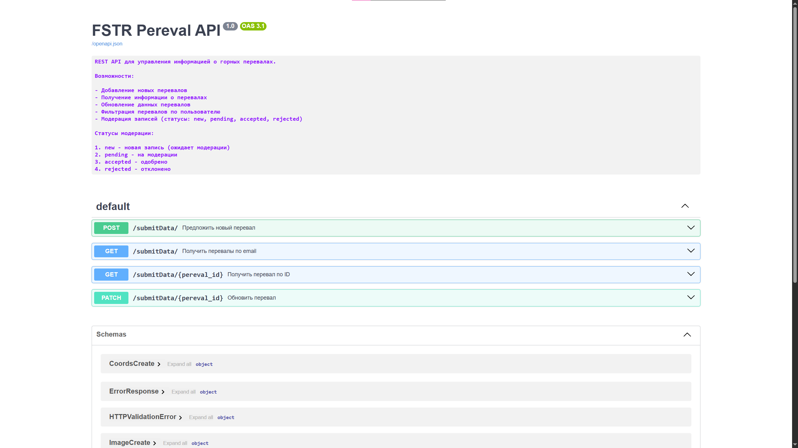

# FSTR Pereval API

REST API для управления информацией о горных перевалах.

### Задача
Разработать REST API для мобильного приложения, позволяющего туристам 
добавлять информацию о новых горных перевалах. Данные должны проходить 
модерацию сотрудниками ФСТР (Федерации спортивного туризма России).

### Что реализовано
- REST API с методами для работы с перевалами
- Система модерации (статусы: new, pending, accepted, rejected)
- Валидация входных данных
- Автоматическая документация Swagger
- Полное тестирование CRUD операций и API эндпоинтов

## Быстрый старт

1. Установите зависимости: `pip install -r requirements.txt`
2. Настройте базу данных: (создайте .env файл)
3. Запустите сервер:`uvicorn app.main:app --reload`


## Документация

FastAPI автоматически генерирует интерактивную документацию.

После запуска сервера откройте:
- **Swagger UI**: http://localhost:8000/docs
- **ReDoc**: http://localhost:8000/redoc
- **OpenAPI схема**: http://localhost:8000/openapi.json




## Как пользоваться документацией:
1. Запустите сервер: `uvicorn app.main:app --reload`
2. Откройте в браузере http://localhost:8000/docs
3. Нажмите на любой эндпоинт -> "Try it out"
4. Заполните данные и выполните запрос


## Основные эндпоинты

| Метод |              Путь              |        Описание        |
|:-----:|:------------------------------:|:----------------------:|
| Post  |         `/submitData/`         | Добавить новый перевал |
|  GET  |       `/submitData/{id}`       | Получить перевал по ID |
| PATCH |       `/submitData/{id}`       |    Обновить перевал    |
|  GET  | `/submitData/?user__email=...` | Перевалы пользователя  |


## Технологии

**FastAPI** - веб-фреймворк для создания API

**SQLAlchemy** - ORM для работы с базой данных

**PostgreSQL** - база данных

**Pydantic** - валидация данных

**Pytest** - тестирование


## Тестирование

Запуск тестов
```bash
pytest -v 
```